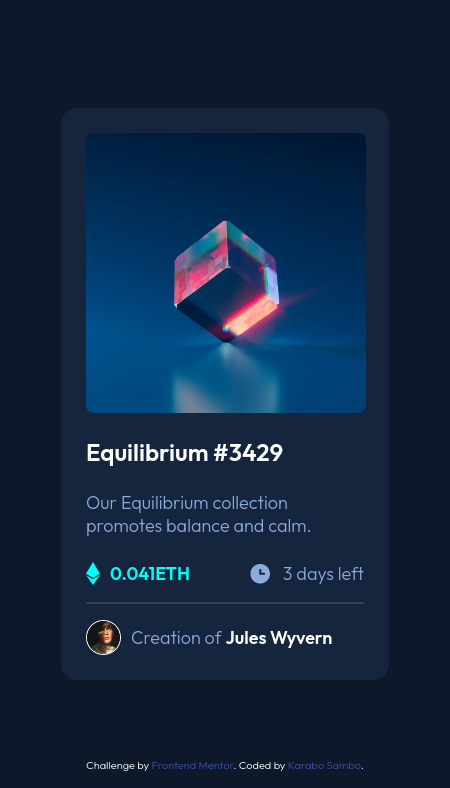
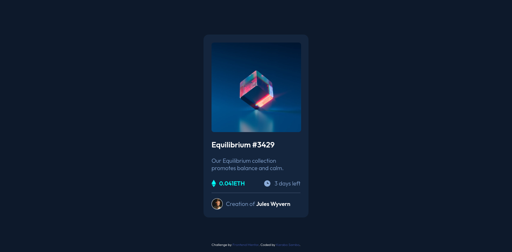

# Frontend Mentor - NFT preview card component solution

This is a solution to the [NFT preview card component challenge on Frontend Mentor](https://www.frontendmentor.io/challenges/nft-preview-card-component-SbdUL_w0U). Frontend Mentor challenges help you improve your coding skills by building realistic projects. 

## Table of contents

- [Overview](#overview)
  - [The challenge](#the-challenge)
  - [Screenshot](#screenshot)
  - [Links](#links)
- [My process](#my-process)
  - [Built with](#built-with)
  - [What I learned](#what-i-learned)
  - [Continued development](#continued-development)
- [Author](#author)
## Overview

### The challenge

Users should be able to:

- View the optimal layout depending on their device's screen size
- See hover states for interactive elements

### Screenshot

### Links

- Solution URL: [Add solution URL here](https://your-solution-url.com)
- Live Site URL: [Add live site URL here](https://blaqbox-prime.github.io/nft-preview-card/)

## My process

### Built with

- CSS custom properties
- Flexbox
- CSS Grid
- Mobile-first workflow

### What I learned

Throughout this project I came to realize how slow I tend to work. I think maybe I tend to underestimate the amount of time it would take to build something and what should take about an hour (according to me anyway) ends up taking almost 2.5 to 3hrs. Fortunately for me I actually enjoy doing this. It does take some time to prepare before actually writing the markup. A lesson I seem to be continuously learning and don't always pay enough attention to. Always take a few minutes to really look at a design and break it down into smaller visual blocks. mentally or drawn on paper. Really helps to figure out the how and have an almost complete mental picture of your code before you even write it.  

### Continued development

One thing that definitely needs work in future projects is CSS Grid. I've shied away from grid for pretty much most of web development learning except for 2 or 3 attempts in some projects. definitely one to take a look at. 

## Author

- Instagram - [@ig_blaqbox.dev](https://www.instagram.com/ig_blaqbox.dev)
- Frontend Mentor - [@yourusername](https://www.frontendmentor.io/profile/blaqbox-prime)
- github - [@blaqbox-prime](https://www.github.com/blaqbox-prime)

